# PoSumo — ML-Agents Architecture

> Generated 2026-08-06 against the active codebase.
> Scope: the 4 trained fighters (`Matt`, `Standard`, `Nick`, `Kim`), their 13-action / 45-observation
> contract, the single inference runtime path, and the per-character reward providers that shape them.
>
> **Authoritative sources**: `Assets/Scripts/Agent/Agent_Biped.cs`,
> `Assets/Scripts/Agent/Agent_BipedBody.cs`, the four `*_Character.asset`,
> the four `Training/configs/*Unified*.yaml`, and the four shipped `.onnx` files at
> `Assets/Agents/<Name>_v01/<Name>.onnx`. Per CLAUDE.md, code constants win over
> prose in any disagreement.

---

## 1. Runtime Inference Loop

The shipped brains are PPO continuous policies executed by the ML-Agents
`ModelRunner` against a `Unity.InferenceEngine.ModelAsset` (`com.unity.ai.inference`
**2.6.1** — the runtime is Unity Inference Engine, although the local package's
internal class names still read `SentisModel`). Inference device is `Burst`; the
network has **no LSTM** (`memory_size = [1]`).

### 1a. Simple

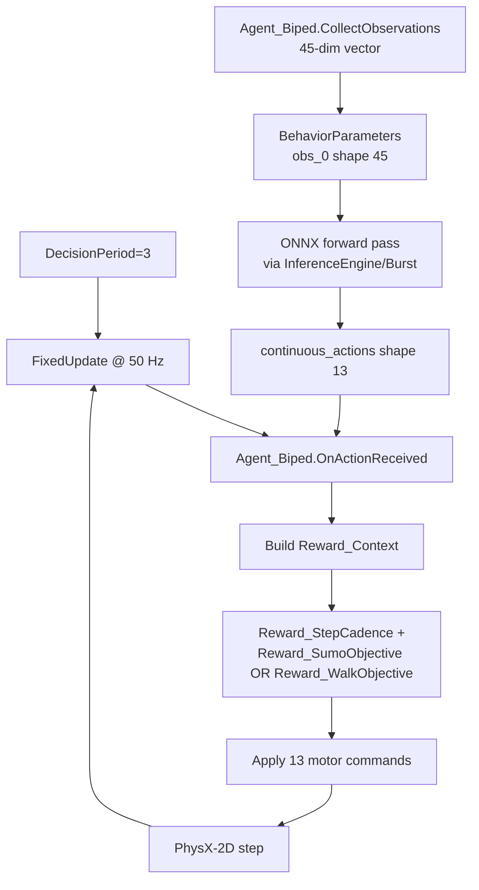

### 1b. Detailed (with tensor shapes and execution path)

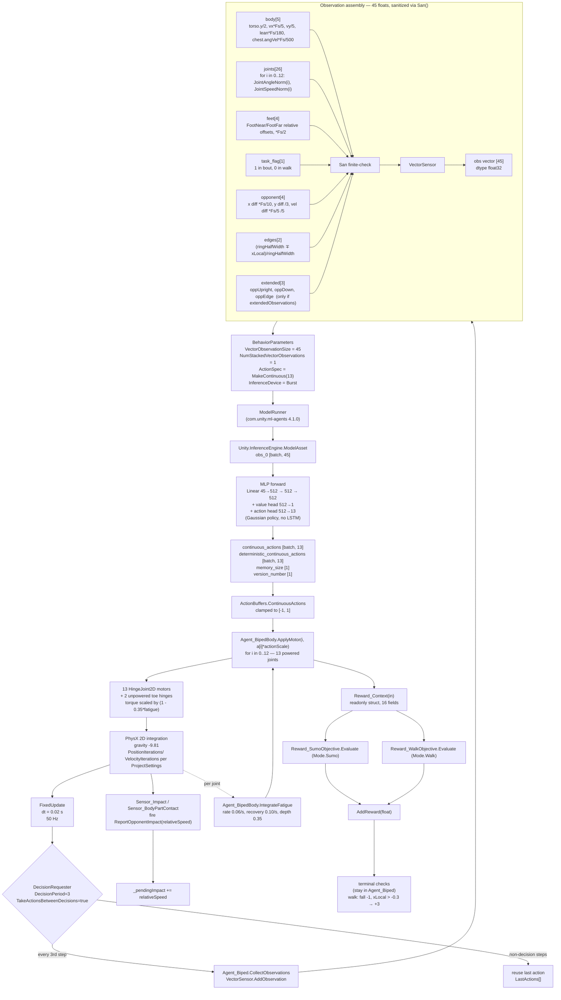

---

## 2. Tensor Blueprint (Observation → Network → Action)

`obs_0 [45]` is fed through a 3-hidden-layer MLP (512 units each) with the same
topology as ML-Agents' PPO default `network_settings: { hidden_units: 512,
num_layers: 3, normalize: true }`. Two heads share the trunk: a Gaussian policy
over the 13 actions and a scalar value head.

### 2a. Simple

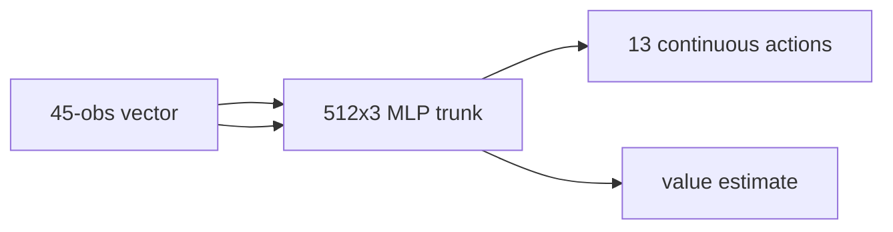

### 2b. Detailed (layer-by-layer)

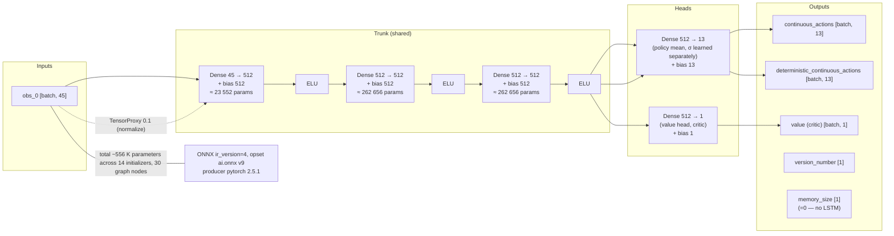

> All four fighters use the **identical topology** (same initializers count,
> same total ~556 K params, identical file size 2 228 786 bytes). They differ
> only in trained weights.

---

## 3. Reward Tree

Per-step shaping is split between two providers (`Reward_SumoObjective`,
`Reward_WalkObjective`) plus the shared `Reward_StepCadence`. Episode **terminals**
(`SetReward(-1)` on fall, `AddReward(3)` on walk graduation, and the ±1 from the
referee) stay in `Agent_Biped` and cannot move — providers are
structurally incapable of ending an episode.

### 3a. Simple

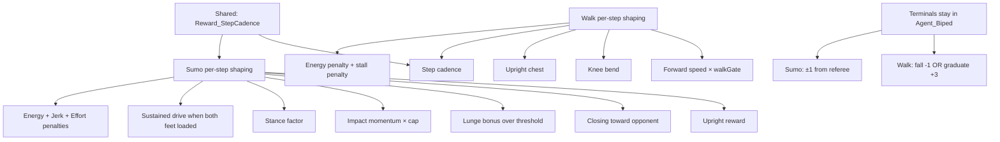

### 3b. Detailed (terms + coefficients + which fighter differs)

```mermaid
graph TD
    subgraph PER_STEP["Per-step shaping — Agent_Biped.OnActionReceived @ 50 Hz"]
        UPR["uprightReward · ctx.Upright<br/>default 0.0005"]
        CLO["closingReward · closing·bendGate<br/>default 0.0006"]
        LUN["lungeBonus · max(0, closing-thresh)·bendGate<br/>default 0.001 @ 1.5 m/s"]
        IMP["impactReward · min(impact, cap) · 1<br/>default 0.010 cap 8"]
        RIS["riseReward · (torsoY - lastTorsoY)<br/>fixed 0.02 — used only while IsDown"]
        KNE["kneeBendReward · ctx.KneeBend · 1<br/>default 0.0004"]
        HPS["hipsLowReward · HipsLowFactor<br/>default 0.0003"]
        CAD["cadenceReward · cadence.Evaluate<br/>default 0.0015<br/>(shared Reward_StepCadence)"]
        STA["stanceReward · StanceFactor<br/>default 0.0009"]
        DRV["driveReward · drive·grip<br/>default 0 — only paid when both feet down"]
        PEN1["energyPenalty · |a|<br/>default 0.0004 (gated by 1-useful)"]
        PEN2["jerkPenalty · |Δa|<br/>default 0.0003"]
        PEN3["effortPenalty · a² (UNGATED, quadratic)<br/>default 0.0015"]

        SUMO["Reward_SumoObjective.Evaluate<br/>returns float"]
        UPR --> SUMO
        CLO --> SUMO
        LUN --> SUMO
        IMP --> SUMO
        RIS --> SUMO
        KNE --> SUMO
        HPS --> SUMO
        CAD --> SUMO
        STA --> SUMO
        DRV --> SUMO
        PEN1 --> SUMO
        PEN2 --> SUMO
        PEN3 --> SUMO
    end

    subgraph PER_STEP_WALK["Walk school"]
        WFR["walkForwardReward · vx·Fs·walkGate<br/>default 0.004"]
        WST["walkStanceFloor · 0.15..1"]
        WBN["walkBendReward · KneeBend<br/>default 0.0006"]
        WUP["walkUprightReward · Upright<br/>default 0.001"]
        WCD["walkCadenceReward · cadence.Evaluate<br/>default 0.002"]
        WEN["walkEnergyPenalty · |a|<br/>default 0.0003"]
        WSP["walkStallPenalty · 0.0008<br/>when |vx| < 0.15 m/s"]

        WALK["Reward_WalkObjective.Evaluate<br/>returns float"]
        WFR --> WALK
        WST --> WALK
        WBN --> WALK
        WUP --> WALK
        WCD --> WALK
        WEN --> WALK
        WSP --> WALK
    end

    subgraph SHARED["Shared cadence"]
        CADX["Reward_StepCadence.Evaluate<br/>MIN_STEP_INTERVAL 0.25 s<br/>PLANTED_HEIGHT 0.12 m<br/>PLANTED_SPEED 0.5 m/s"]
    end

    CAD --> CADX
    WCD --> CADX

    subgraph TERMINALS["Terminals (Agent_Biped, NOT providers)"]
        TW1["Walk: IsDown → SetReward(-1), EndEpisode()"]
        TW2["Walk: xLocal > -0.3 → AddReward(3), EndEpisode()"]
        TS1["Sumo: ±1 from Systems_SumoMatchManager<br/>foot below footOffMatY OR torso below fallY<br/>timeout → EpisodeInterrupted (draw)"]
    end

    subgraph PERSONALITIES["Per-character deviations from defaults"]
        M["Matt — closing 0.0009, lunge 0.0016 @ 1.2, impact 0.015 cap 8, cadence 0.0015"]
        N["Nick — cadence 0.0032 (highest), lunge 0.0024 @ 1.0,<br/>closing 0.0011, impact 0.011 cap 8, straightLegEarnFraction 0.75<br/>(reward-hack risk — see Nick MANIFEST)"]
        K["Kim — kneeBend 0.0008, hipsLow 0.0008, impact 0.014 cap 10,<br/>closing 0.0004, lunge 0.0008 @ 1.8,<br/>cadence 0.0006, straightLegEarnFraction 0.15"]
        S["Standard — code defaults (asset's eight fields are all null)"]
    end

    SUMO --> ADD[AddReward]
    WALK --> ADD
    CADX --> SUMO
    CADX --> WALK
    TW1 --> END[EndEpisode]
    TW2 --> END
    TS1 --> END

    M -.->|per-coefficient override| SUMO
    N -.->|per-coefficient override| SUMO
    K -.->|per-coefficient override| SUMO
```

---

## 4. Actuator Map (Action → Joint Drive)

13 continuous actions (clamped to `[-1, 1]`) map one-to-one onto 13 powered
`HingeJoint2D`s. Motor torque is **scaled by muscle fatigue**: every joint's
applied torque is multiplied by `(1 - FATIGUE_DEPTH * fatigue)` where
`fatigue ∈ [0, 1]` is integrated at 50 Hz from the joint's measured
`GetMotorTorque(dt)`. Two unpowered toe hinges (MTP joints) carry limits and
passive resistance but no motor; they are deliberately appended after the 13
powered ones.

### 4a. Simple

```mermaid
flowchart LR
    A[13 continuous actions<br/>clamped [-1,1]] --> J[13 hinge motors]
    J --> B[2D ragdoll]
```

### 4b. Detailed (per-joint breakdown)

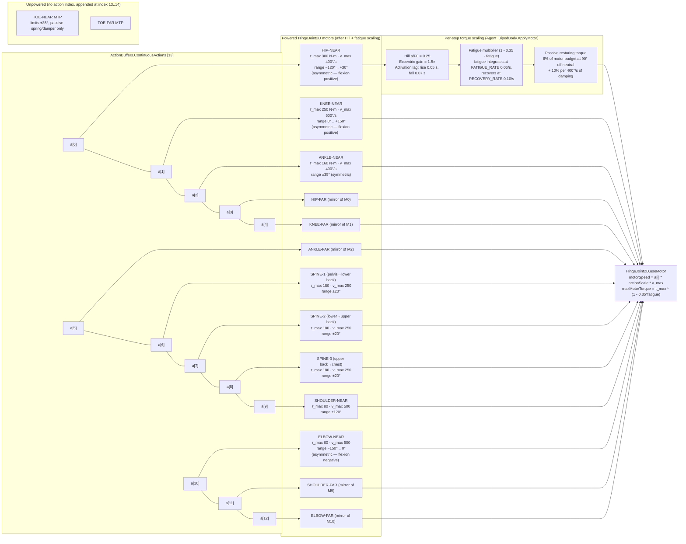

---

## 5. Hyperparameter Matrix (PPO Config)

All four fighters share an **identical PPO trunk** — only one fighter's
hyperparameters have been deliberately tuned away from the baseline.

### 5a. Simple

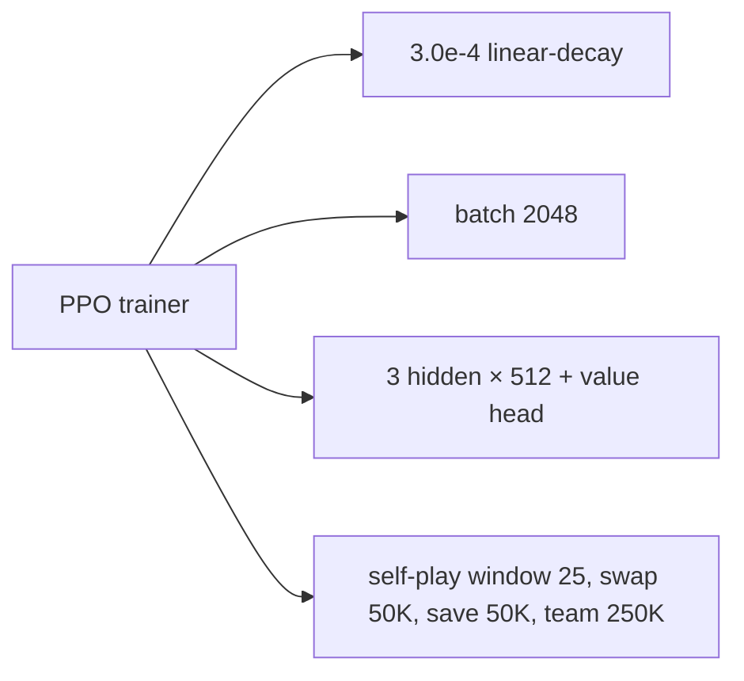

### 5b. Detailed (per-fighter deviations)

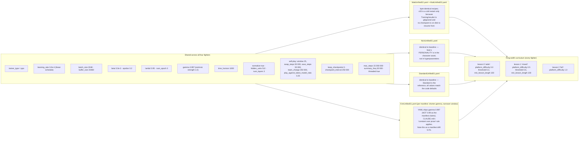

---

## 6. Episode Lifecycle

Every agent's episode goes through `Agent_Biped.OnEpisodeBegin` →
`OnActionReceived` (every physics step) → either a walk terminal (in agent),
a sumo terminal (in `Systems_SumoMatchManager`), or the round clock.

### 6a. Simple

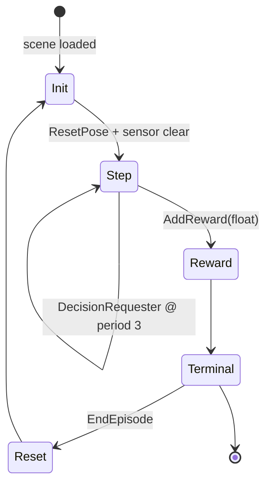

### 6b. Detailed

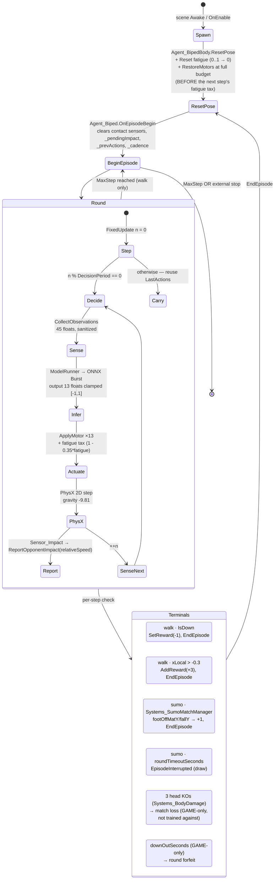

---

## Notes for future maintainers

- **Observation count authority**: `Agent_Biped.ObservationCount = 42` (base)
  with the `extendedObservations` bool adding **+3** for a 45-slot vector. The
  xml-doc comments in `Agent_Biped.cs` and the tooltips on
  `Agent_CharacterDefinition.cs` still reference the legacy "41 obs / 44 obs"
  contract — they are stale and should be re-worded to match the +1 task-flag
  addition.
- **Action count authority**: 13 powered joints, always. The two unpowered
  toe hinges are appended after `ActionCount` and never sent through the
  network, so adding another driven joint requires both an input and output
  layer change and invalidates every shipped `.onnx`.
- **Inference engine authority**: `Unity.InferenceEngine.ModelAsset`
  (`com.unity.ai.inference` 2.6.1). The local `com.unity.ml-agents` 4.1.0
  package still calls its inference classes `SentisModel` internally — the
  runtime is the Inference Engine, not legacy Sentis/Barracuda.
- **Reward providers are stateless w.r.t. the agent**: they return a `float`
  and cannot end an episode. The walk fall / walk graduation terminals stay
  hardcoded in `Agent_Biped` to keep reward scales comparable across
  characters on TensorBoard.