# PoSumo — Architecture Diagram Suite

> **Scope note.** The originating request named `Assets/Scenes/CreatureTrainingRace.unity`,
> a `config/` directory and `results/<run_id>/run_summary.json`. **None of those exist in
> this project** — they belong to a different ML-Agents codebase. This suite documents
> what PoSumo actually contains: `SCN_*` scenes, `Training/configs/*.yaml`, and
> `Training/results/<run_id>/<Behavior>/`, which stores `checkpoint.pt` + tfevents and has
> no `run_summary.json`. Every number below is measured from the live project, not assumed.

All figures verified 2026-07-27 against the running corrective training pass.
Trainer is **PPO for every brain** — there is no SAC config in this repo.

---

## 1. Runtime Inference Loop

### 1-simple

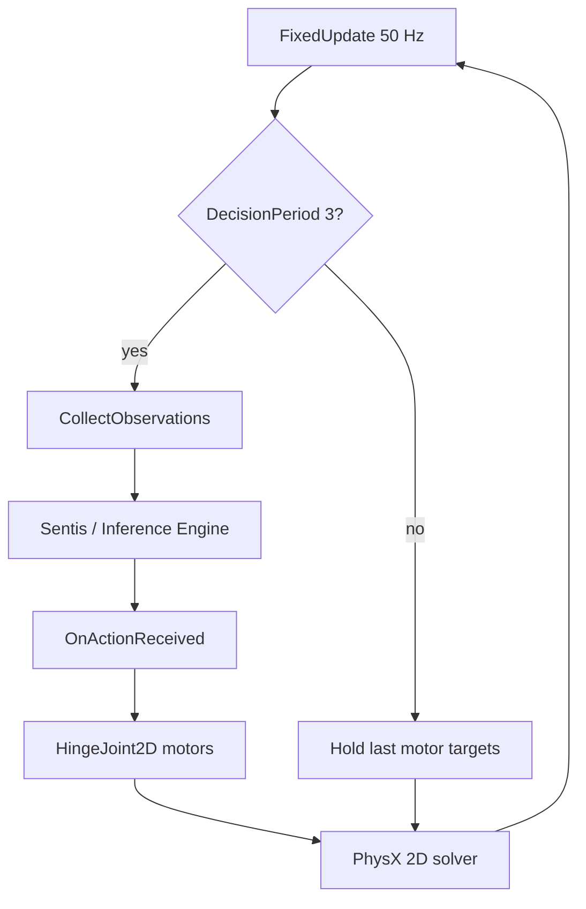

### 1-detailed

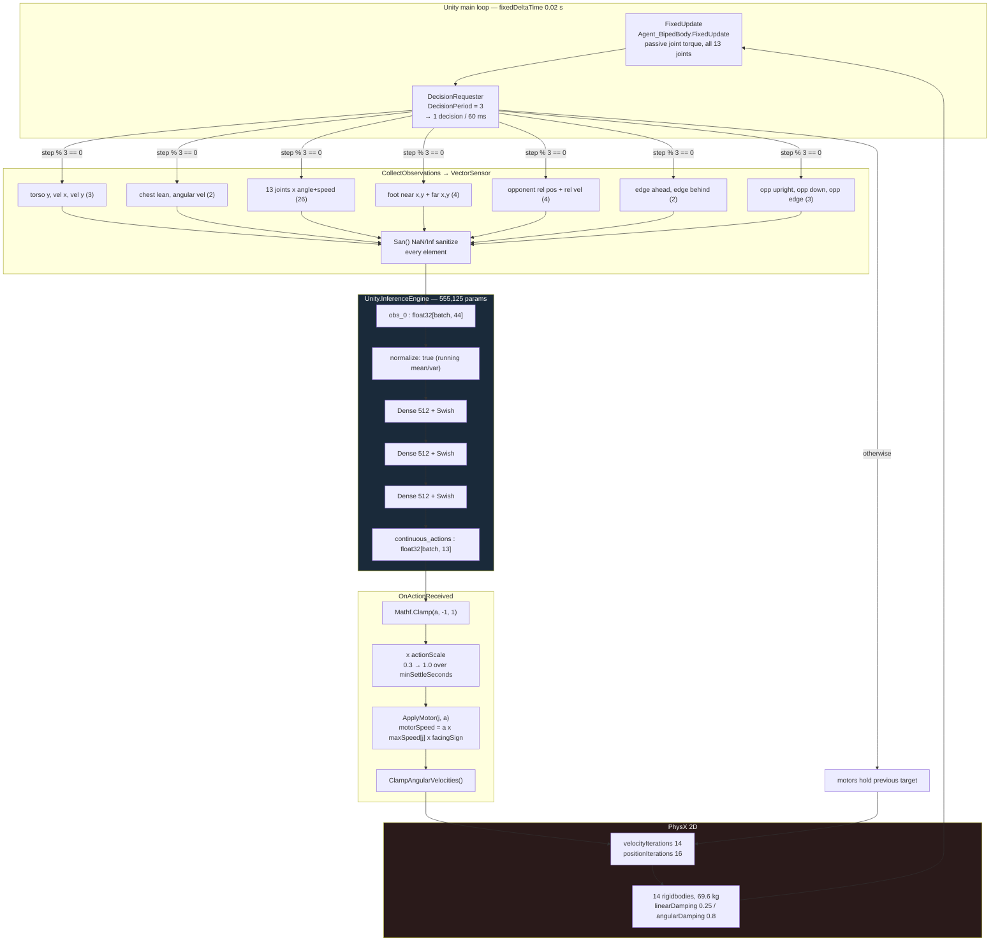

**Timing consequence.** The policy acts every 60 ms while physics runs at 20 ms, so
motors hold their target for 3 ticks. Passive joint resistance deliberately runs in
`FixedUpdate` (every tick) rather than on the decision boundary — tissue does not take
turns with the brain.

---

## 2. Tensor Blueprint

### 2-simple

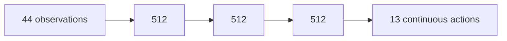

### 2-detailed

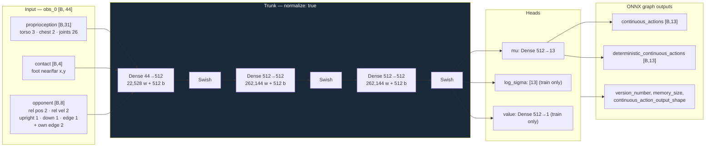

| Fact | Value | Source |
|---|---|---|
| Input tensor | `obs_0 : [batch, 44]` | read from every deployed `.onnx` |
| Action tensor | `continuous_actions : [batch, 13]` | ditto |
| Total parameters | **555,125** | summed ONNX initializers |
| File size | 2.12 MB per brain | `os.stat` |

`memory_size = 0` — these are feed-forward policies, no recurrence.

---

## 3. Reward Tree

### 3-simple

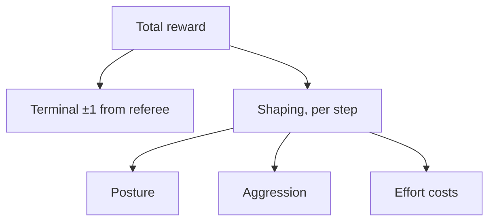

### 3-detailed

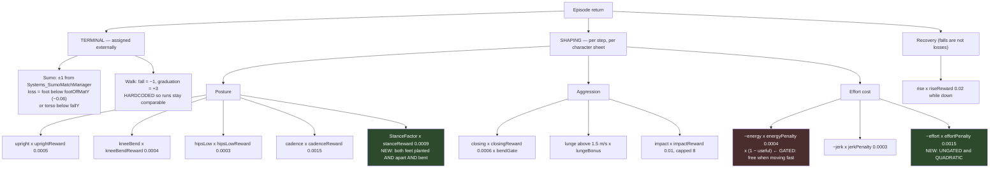

**The two green nodes are new in the realism pass and are why the brains needed
retraining.** The red node is the defect they address: `energyPenalty` is multiplied by
`(1 − useful)`, so motor effort became *free* whenever the fighter moved fast. Measured
consequence before the fix: **7–12 of 13 motors railed above |0.9|**, mean |action|
0.75–0.91. After 250k corrective steps: **3/13 railed**, mean(a²) 0.45 vs 0.83.

---

## 4. Actuator Map

### 4-simple

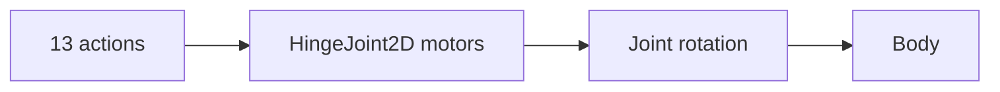

### 4-detailed

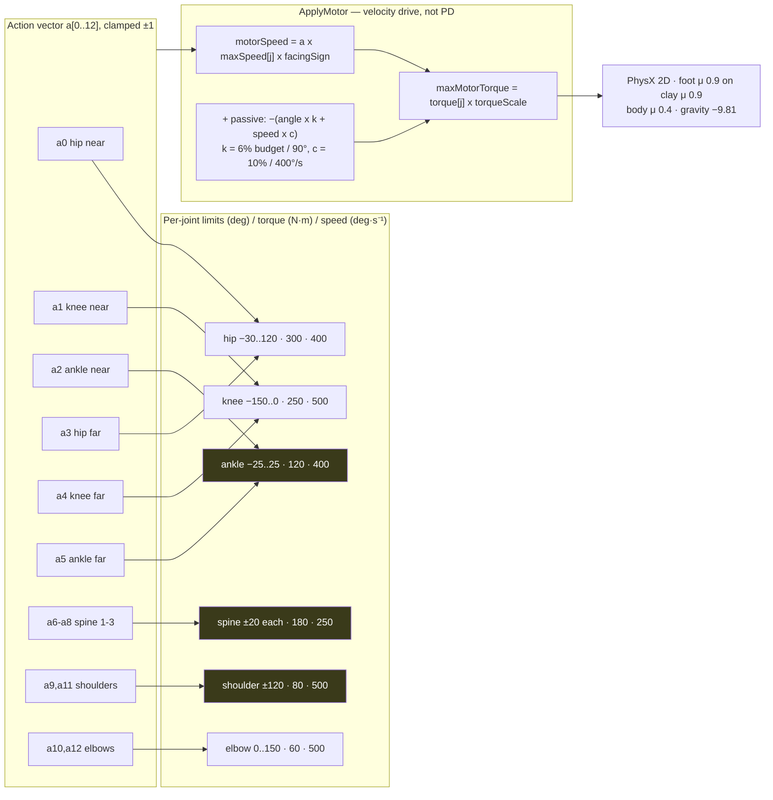

**Not a PD controller.** `HingeJoint2D` exposes a *velocity* motor with a torque ceiling,
so there is no $K_p$/$K_d$ pair — the analogue is `motorSpeed` (target rate) bounded by
`maxMotorTorque`. Unity 2D hinges have **no spring**, which is why passive elasticity is
applied as an explicit restoring torque in `FixedUpdate` rather than via joint settings.

Yellow nodes were clamped in the realism pass (ankle ±45→±25, spine ±25→±20 each,
shoulder ±160→±120). They remain symmetric: flexion sign differs per joint in this rig
and assigning asymmetry blind risks inverting a usable range.

---

## 5. Hyperparameter Matrix

### 5-simple

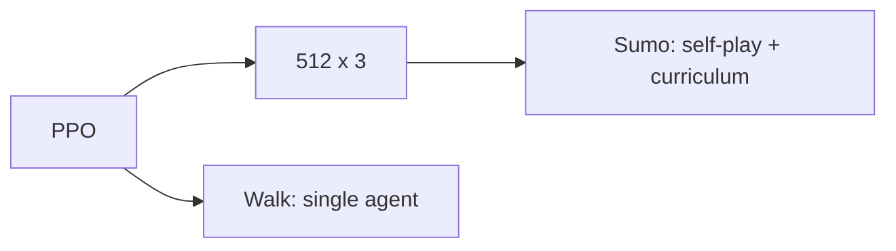

### 5-detailed

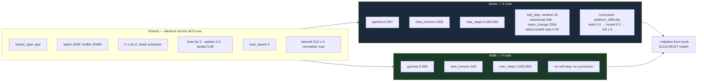

`network_settings` must match the trunk exactly or `--initialize-from` cannot load the
weights. `lr 1.5e-4` sits between the 1.0e-4 used for a contact-shape tweak and the
3.0e-4 of a fresh run — the body changed, so this is more than a nudge and less than a
rebuild.

---

## 6. Episode Lifecycle

### 6-simple

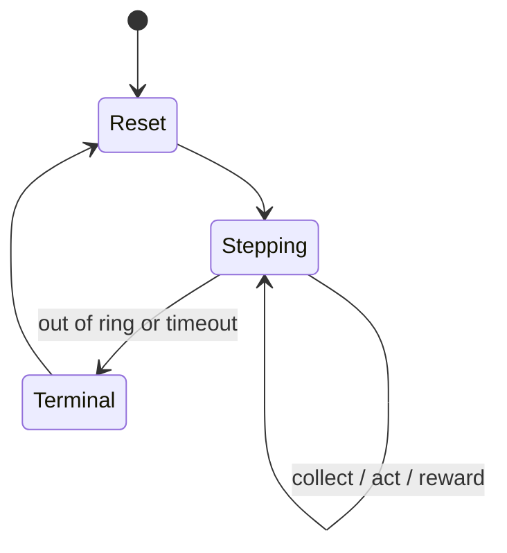

### 6-detailed

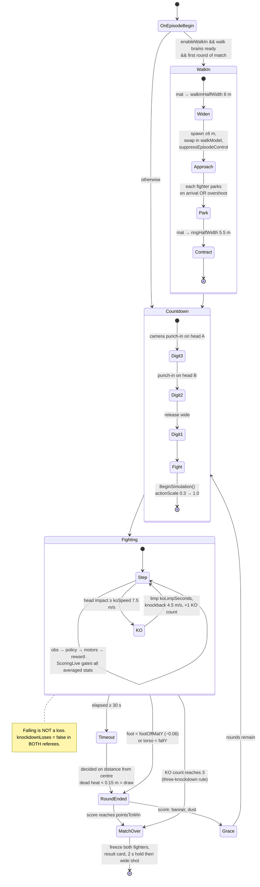

---

## Cross-references

| Concern | File |
|---|---|
| Body tables (`PART_DEFS`, `JOINT_DEFS`) | `Assets/Scripts/Agent/Agent_BipedBody.cs` |
| Observations, actions, reward shaping | `Assets/Scripts/Agent/Agent_Biped.cs` |
| Per-fighter coefficients | `Assets/Scripts/Agent/Agent_CharacterDefinition.cs` |
| Game referee | `Assets/Scripts/Systems/Systems_GameMatchManager.cs` |
| Training referee + domain randomisation | `Assets/Scripts/Systems/Systems_SumoMatchManager.cs` |
| Shared tuning (ring, walk-in, camera) | `Assets/Settings/GameTuning.asset` |
